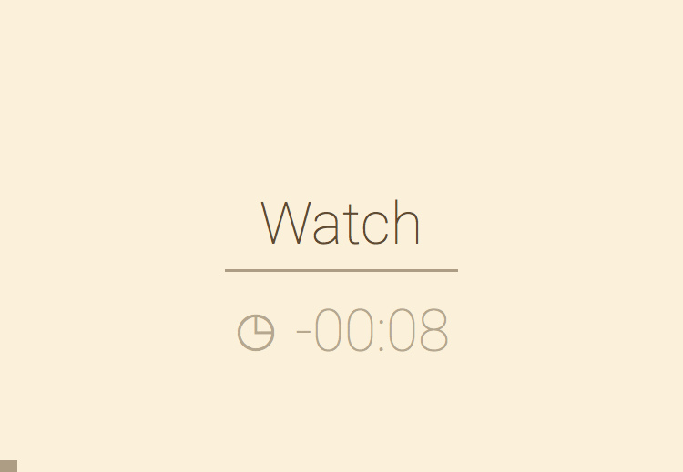

# WordyWordy
WordyWordy takes text that's dropped on it and shows it. One word at a time. As fast as you want. Or as slow.

## Why and for whom?
**Faster**.
  It is possible to read faster than reading the typical ~250-300 words per minute.
  I get about 340 wpm comfortably, but I read some people get ~600 wpm, without
  loosing comprehension.
  
**Bigger**. 
  You can show words stupid big when only displaying one of them at the time. 
  This might be useful when you have low vision.

**Hands free**.
  It keeps on rolling. Practical when you want to read while doing 
  something else. Working out for example.
  
  I've read claims that presenting text this way helps people with dyslexia
  read more easily. I don't know. I have included a font designed for 
  people with dyslexia, just in case. They're under keys `6`, `7`, `8`, `9` and `0`.

TODO: mention that you won't need to hunt for the start of a sentence.
TODO: add links to claims & research

## Screenshots!




## Features
- Proportionally pauses on punctuation and paragraphs, for a natural reading experience.
- Adjustable speed. On the fly.
- Remembers your last text. And where you left of in it.
- Forward/ backward navigation with mouse and/ or keys. On the fly.
- Adjustable theme to match your taste. Or need:
  - Sepia/ Day/ Night
  - High contrast (yellow on black, fat letters)
  - Night low contrast
  - Regular and dyslexic friendly fonts.
- Supports Chinese/ Japanes/ Korean. There is a reason 字 translates to _character_, but also to _word_.
- Heuristics for correcting common typographic errors.
- Reading stats on the current text.
- It smiles. (Go on, drag something on it. You'll see).

## Keyboard and mouse bindings
You'll figure this out in a pinch. Probably without even checking this table. Trust me.

When you want this         |  keyboard                        | mouse        
-------------------------- | -------------------------------- | ---------------------------------
pause/ play                | `SPACE` or `ENTER`               | click the _right_ of the screen
go slower                  | `DOWN` or `s`                    | click the _bottom_ of the screen
go faster                  | `UP` or `w`                      | click the _top_ of the screen
go back a word             | `LEFT` or `a`                    | scroll down
go back a sentence         | `PAGEUP` or `q`                  | click the _left_ of the screen
go forward a word          | `RIGHT` or `d`                   | scroll up
go forward a sentence      | `PAGEDOWN` or `e`                | -
go to start of text        | `HOME`                           | -
change Theme               | `1`, `2`, ..., `9`, `0`          | -
show amount of time left   | `t`                              | - 
show stats                 | `.` or `,`                       | - 
save current position      | `b`                              | - 
jump to position           | not implemented yet              | click in the progress bar (bottom)
clear                      | `c`                              | -

- @scrolling: effect depends a bit on your mouse/ track pad. 
- @themes: `1`-`5` are the regular themes (with _high contrast_ on `5`),`6-0` the  dyslexic ones.
- @save current position: pausing or navigating automatically save the position. Heck, it even magically saves _speed_ and _theme_ along with the _position_.
  Hit `b` when you don't trust that. Or when you don't pause or navigate.
- @clear: makes WordyWordy forget  all stuff it usually remembers (buffer, title, last saved position, speed, theme).

## Bookmarklet
There is a [bookmarklet](bookmarklet.js). It works. It's not yet perfect.

## URL parameters
(Skip this if you don't know what an URL parameter is. You won't miss anything.)

parameter | explanation
--------- | -----------------
speed     | A `number` between 60 and 600 words per minute. When WordyWordy doesn't understand, it'll pick a default speed (300 wpm).
pos       | A number representing the position (word) to start reading. When WordyWordy doesn't understand, it will start at position 0.
text      | Text to read. Expected to be URI encoded. When left out, WordyWordy will start reading from the latest text you left last time your started it.
theme     | a number between 0 and 12 - each of which represents a theme. 
play      | 1 or 0 - if this parameter equals `1`, the text will automatically start playing, about a second after it was loaded.
loop      | 1 or 0 - if this parameter equals `1`, the text will infinitely loop. Usefull for kiosk display.


Example: 
```
https://sverweij.github.io/wordywordy/index.html?speed=200&theme=6&pos=0&play=1&text=This reads some text to you at about 200 words per minute. The text is presented in the open dyslexic font with a sepia color scheme. 
```

## A word on speeds
The speed you selected is the _target_ speed. It is a good indication of the actual speed. 
However, the actual speed depends on the characteristics of the selected text. E.g.
- Your text contains many long words and short sentences: the actual speed will be _slower_ than the target speed.
- Your text contains many short words and long sentences: the actual speed will be _faster_.

## Licenses and dependencies
WordyWordy is free software [licensed under GPLv3](LICENSE). This
means (a.o.) you *can* use it as part of other free software. You
can *not* use it as part of non free software.

WordyWordy uses two non-standard fonts:
- **Roboto** (from Google's Android).
After hours of testing, this one came out as easiest on the eyes.
- **[Open Dyslexic](https://github.com/antijingoist/open-dyslexic)**.
Used in the dyslexic themes. Bottom heavy and asymetric, just like the theory
says it should. I hope it improves usability for dyslexic people.

## Frequently Anticipated Questions
Q: You haven't mentioned RSVP (rapid serial visual presentation) once. This _is_ RSVP, isn't it?
> A: It is Serial, and it's Presenting things. Visually. But it's only rapid when you want it to. 

Q: Did you hear of ... ?
> A: Yes. Some of the options out there are excelent and seem well-researched
> and field tested. 
> By all means, use them!

Q: Why did you implement this?
> A: I had a (self written) thing like this lying around when 
> hunting sabre tooth tigers was all the rage and dinosaurs still
> roamed the earth. I used it for some time but it was 
> hampered. By technologic restrictions (getting html to work in
> IE on windows CE was challinging). And by my lack of subject
> matter knowledge. 
> 
> During 2014 christmas holiday I needed a vehicle to test some
> technical stuff for an other project. This fit the bill.

Q: Do you have a road map? 
> A: Kind of. Expect small things like
>  - better usability on mobile devices
>  - polished bookmarklet
>  - multiple buffers
>  - icon
>  ~~~- an old-fashioned file open dialog~~~
>
> I'd also like to clean up the code ~~a bit~~

Q: Do you have a time line?
> A: Not really. This thing shares time with some other projects
> ([mscgen_js](https://sverweij.github.io/mscgen_js), work. Life).

Q: Are you afraid you'll stay the only user of this?
> A: No. On the other hand - having an FAQ on github
> would be a bit awkward.
